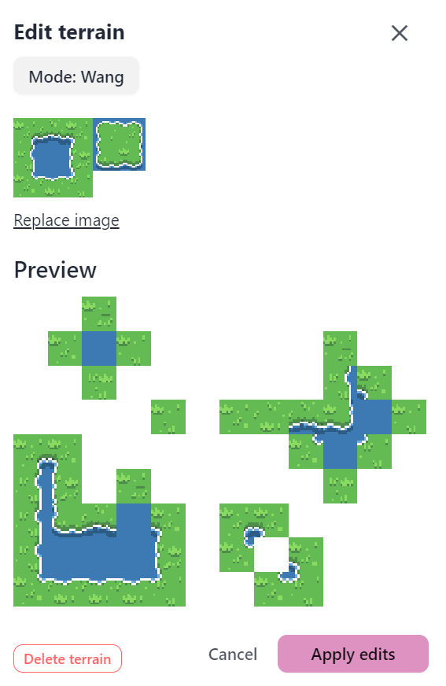

Asset management in Pixel Stories is designed to help users effectively manage all types of game assets. Game assets include images, animations, actors, sounds/music, and variables.

Uploading assets into Pixel Stories is designed to be simple for users. Each asset is individually uploaded into the game to improve organization and facilitate building your game step by step.

## Key Features

The following are the features which make assets easy to handle in Pixel Stories.

### Easy Upload

When adding an asset, you can drag and drop files directly into game engine. The asset will be uploaded immediately into the engine.

### Replaceable Assets

Story-driven games are destined to evolve as you work on it. So Pixel Stories assets, including images, animations, music, and sound, are designed to be easily replaceable. When you replace an asset, the changes reflect immediately in your game.

### Wide Support for File Types

Since our game engine is web-based, we can automatically support a wide range of file types. The following are what's supported.

**Audio:**

- .ogg
- .mp3
- .m4a

**Images:**

- .png
- .jpeg
- .gif (only first frame will show)
- .svg
- .webp
