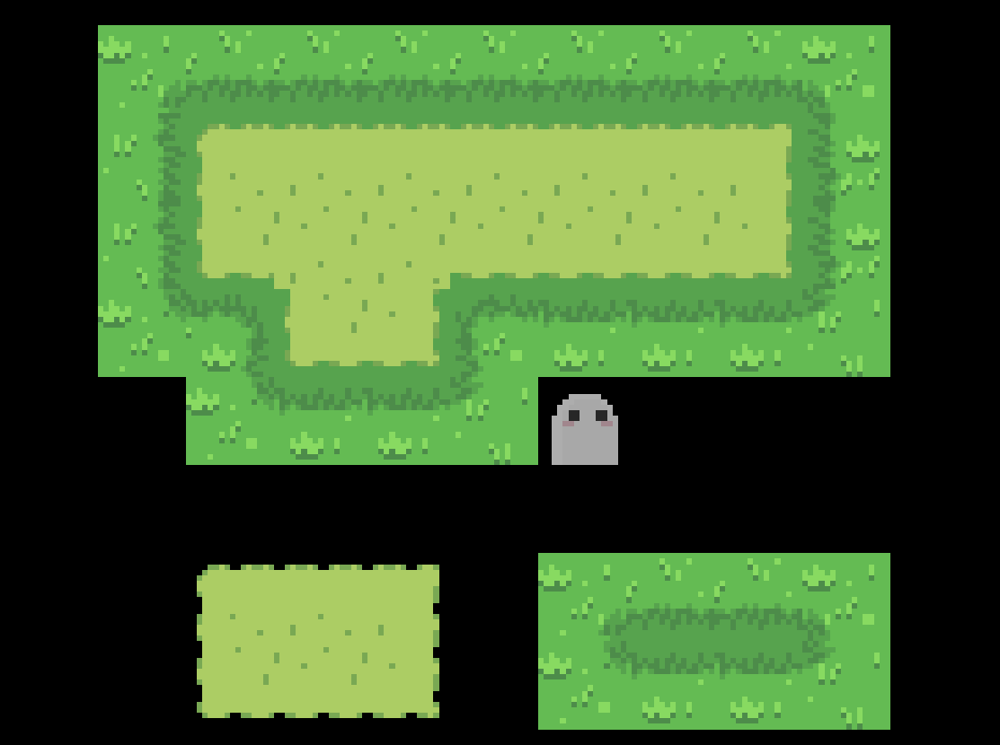
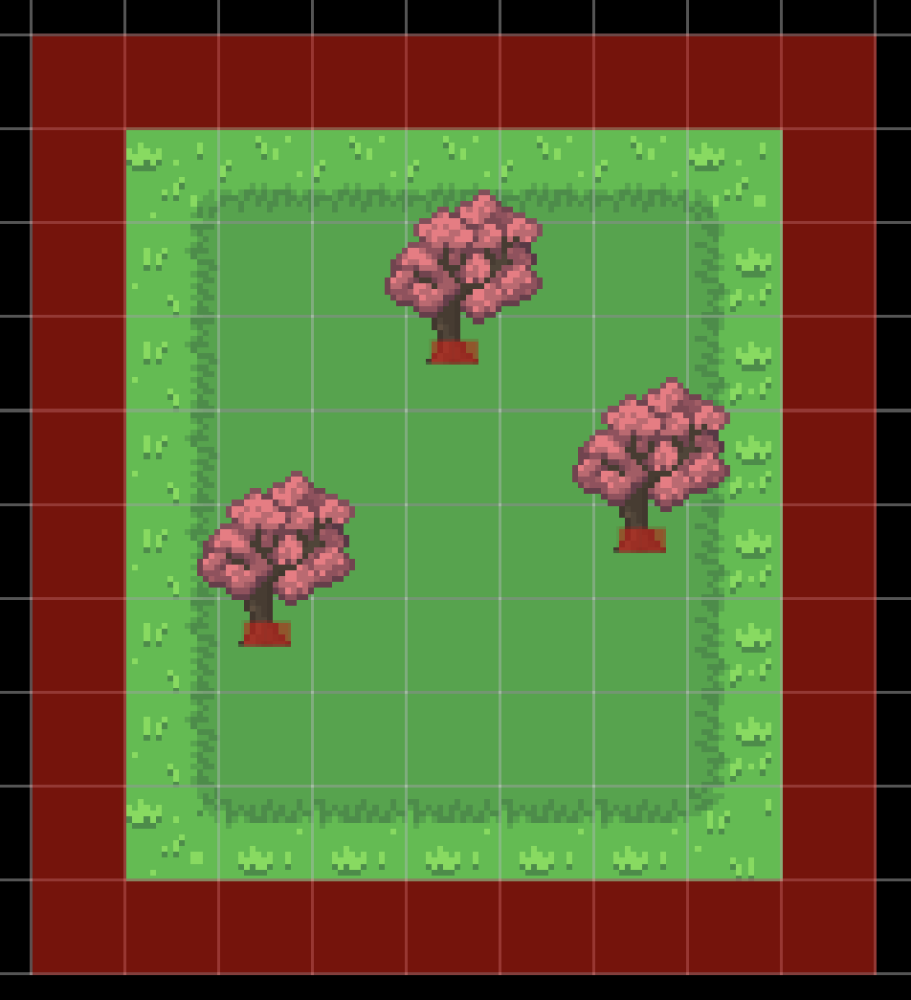

The following sections explain how the map editor in Pixel Stories works. The key features include terrains, auto tiling, terrain layers, map objects, and collisions. They all work together to create beautiful, interesting, and dynamic game maps.

## Terrains

In Pixel Stories, terrains are created by providing a source tileset and selecting the type. We currently support 4 types of tilesets.

Basic

<pixel-art>

</pixel-art>

Basic full (includes extra tile for border detail)

<pixel-art>

</pixel-art>

RPG Maker

<pixel-art>

</pixel-art>

Wang

<pixel-art>

</pixel-art>

Each map has a defined tile size. The tile size can be any size (i.e. 16px, 32px, 48px, 64px, even 12px). Add tilesets imported in the map must have the same tile size as the map. For instance, a 32px tile size map should only use 32px tilesets to create terrains. Keep in mind, different maps can have different tile sizes.

### Auto Tiling

Once the terrain is created, an auto tileset is generated in the background and the terrain can now be drawn into the map! Auto tiling uses the auto tileset and determines how each tile connects with its neighboring tiles.

### Terrain Layers

You also have full control of the layers and how tiles should be placed on top of each other.

When you use tiles without borders, you can place them on top of a layer and they will fit in seamlessly. This feature is very useful if you want to connect multiple terrains.

## Map Objects

Each map object is individually added into the game. Instead of building on top of a tileset, when you have a new object to add, you simply add the asset in.

When you place the object in the map, depth sorting is automatically handled. Meaning any actors or player will show behind the map object.

## Collisions

The way Pixel Stories handles collisions is by simply drawing collision boxes into the map.

In the example below, the player is bounded within the box and cannot walk right through trees.

